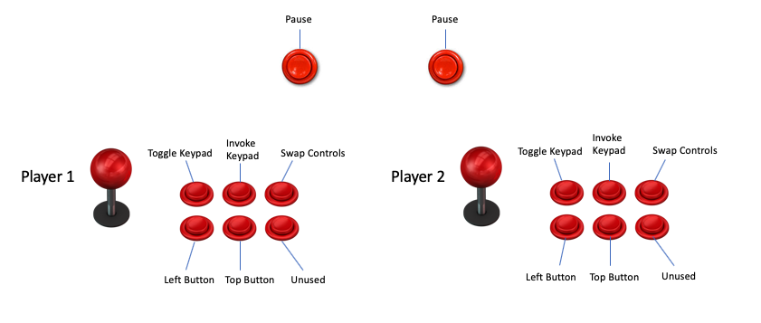

# FreeIntv - - AtGames Legends Ultimate Mod
Current release is v1.0.0.  It can be downloaded from [here](https://github.com/gm2552/FreeIntv/releases/download/1.0.0/freeintv_libretro_alu_alpha-1.so).

## Acknowledgements 
Port of FreeIntv for libretro.  Includes mods specific to the AtGames Legends Ultimate gaming console.  Forked from original source found at https://github.com/libretro/FreeIntv

## Mods

### Embedded Bios

Generally the core requires bios files to be located within a specific folder accessible to the core.  This modded core embedds the bios files within to core itself removing the need to co-locate the bios files in another folder.

### Button Mapping

Intellivision controller buttons have been mapped to the following ALU buttons.  Note that the "X" button toggles the virtual keypad.  Once a button on the virutual keypad has been selected, use the Y button to invoke the selected keypad button.

